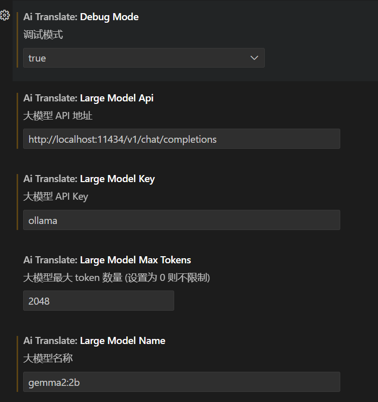

# Comment Translate AI

A VSCode code comment translation plugin that supports large model invocation, serving as a translation source extension for [Comment Translate](https://marketplace.visualstudio.com/items?itemName=intellsmi.comment-translate)

⚠️*This plugin does not provide a large model API. Please prepare your own API and ensure it supports the calling format of OpenAI's API*

[简体中文](README.md)|[**English**](README_en.md)

## ✨ Features

- 🤖 Adopts OpenAI API standards
- 🎯 Intelligent naming of parameters such as functions, classes, and variables, optimizing names according to naming conventions
- ⚡ Fast translation response
- 🛠️ Flexible configuration options

## 📦 Installation

1. Install [Comment Translate](https://marketplace.visualstudio.com/items?itemName=intellsmi.comment-translate)
2. Install this extension[Comment Translate for AI](https://marketplace.visualstudio.com/items?itemName=Cheng-MaoMao.ai-powered-comment-translate-extension&ssr=false#overview)
3. Open the command palette in VS Code (Ctrl+Shift+P)
4. Type "Comment Translate: Change translation source"
5. Select "AI Translate" as the translation source

## ⚙️ Configuration

Configure the following options in VS Code settings:

|                Option                |                                                                   Description                                                                   |               Default               |
| :-----------------------------------: | :----------------------------------------------------------------------------------------------------------------------------------------------: | :----------------------------------: |
|     `aiTranslate.largeModelApi`     |                                                             Large model API endpoint                                                             |                  -                  |
|     `aiTranslate.largeModelKey`     |                                                                     API key                                                                     |                  -                  |
|    `aiTranslate.largeModelName`    |                                                                    Model name                                                                    |                  -                  |
|  `aiTranslate.largeModelMaxTokens`  |                                                        Maximum tokens (0 means unlimited)                                                        |                 2048                 |
| `aiTranslate.largeModelTemperature` | The temperature parameter of a large model (a lower value produces more certain results, while a higher value yields more diverse outcomes) |                 0.2                 |
|      `aiTranslate.namingRules`      |                                                                Naming Conventions                                                                | Translation: Determined by AI itself |
|`aiTranslate.translatePrompt`|Custom Translation Prompts   you can use `<targetlang>` to express your target language|Check Configuration (Please fill in completely, you can reset to get the original settings)|

## 🚀 Quick Start

1. **Configure API Information**  
   Make sure that the large model service provider you are using is compatible with the OpenAI API call format. For detailed API call instructions and usage, please refer to the [Open AI official documentation](https://platform.openai.com/docs/api-reference/chat).  
   You can also refer to the [Immersive Translation Configuration Documentation](https://immersivetranslate.com/zh-Hans/docs/services/ai) for more configuration details.

   **Recommended Service Providers**:
   - It is recommended to use [DeepSeek](https://platform.deepseek.com/), as this model has excellent performance and the token price is relatively inexpensive. This is not an advertisement, just a recommendation.

   **Configuration Example**:  
   

   You can also use **Ollama** to invoke the local model. I personally use `gemma2:2b`, which offers good response speed and translation quality.

   **Ollama Configuration Example**:  
   

   **Prompt Configuration**:  
   

   **Prompt Effect Display**:  
   

2. **After Configuration**  
   After completing the configuration, invoke the “Comment Translate” command in the “Comment Translate: Change translate source” option.

   

3. **Select Translation Source**  
   In the popup options, choose the translation source as **"AI translate"**.

   

### How to use "AI Naming"

* Right-click the mouse→Select "Comment Translation" from the list→Click "AI Naming" to use it
* Translate the naming according to the selected naming format into English
* Optimize naming according to the naming convention
  

## 🤝 Contributing

Issues and Pull Requests are welcome!

## 📝 Changelog

### 0.0.1

- 🎉 Initialize project
- ✨ Implement basic translation
- 🔧 Add configuration options

### 0.0.2

- 🔧 Modify setting name

### 0.0.3

- 🔧 Add Model Temperature setting

### 0.0.4

- 🤖 Add an AI naming feature that allows the AI to intelligently assign names to parameters such as variables, functions, and classes based on your settings or its own judgment
- 🌐 Added configuration files for multilingual environments

### 0.0.5

- 🔍 "Debug feature" has been added in the plugin settings

### 0.0.6

- 🤖 Optimized AI prompts

### 0.0.7

- 🔧 Add custom prompt settings

## 🙏 Acknowledgments

This project is developed based on the following excellent open-source projects:

- [vscode-comment-translate](https://github.com/intellism/vscode-comment-translate) - VSCode comment translation extension
- [deepl-translate](https://github.com/intellism/deepl-translate) - DeepL translation extension, the source of our base code

Special thanks to:

- [@intellism](https://github.com/intellism) for providing the excellent plugin framework and reference implementation

## 📄 License

This project is licensed under the [MIT License](LICENSE).

Some code is modified from [deepl-translate](https://github.com/intellism/deepl-translate), following its MIT license.
